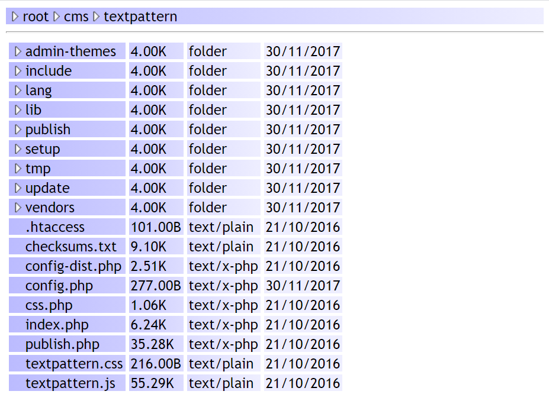

psfb
====

Easy and simple file browser in one single PHP file with zero-configuration.

#Screenshot:


#Installation:
* Make sure you have at least PHP 5.3 installed.
* Download ```browser.php``` and put it in any folder on your webserver.
* (Optional: rename ```browser.php``` to ```index.php``` if you want).
* Done.
